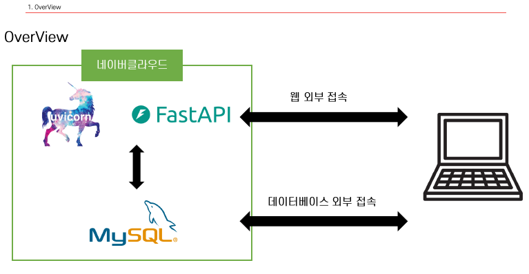
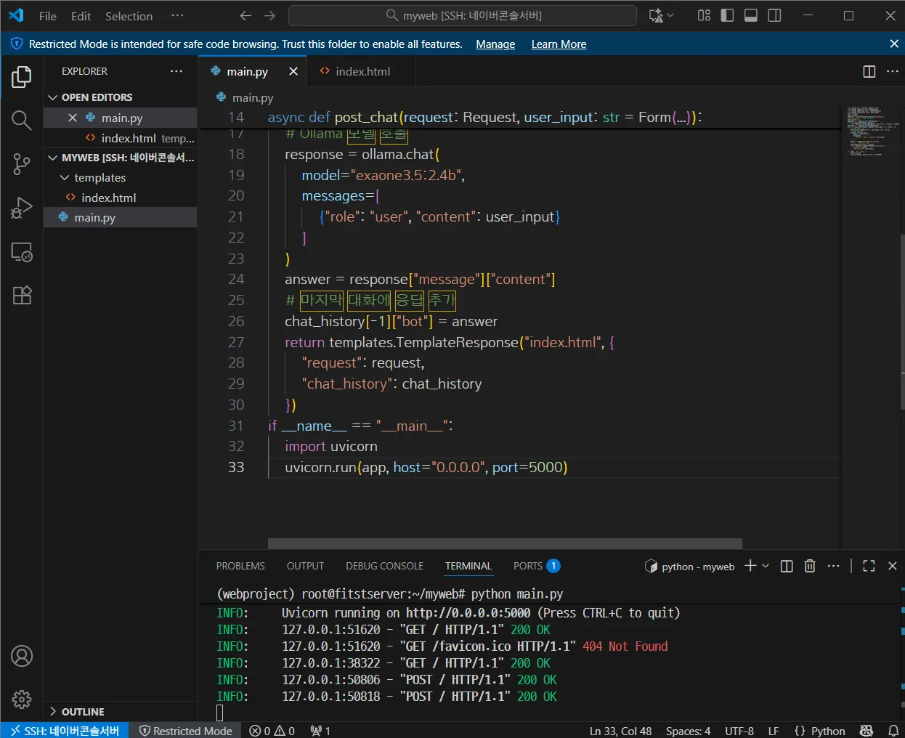

# 클라우드

## 알고가야할 개념

- PaaS : 애플리케이션 개발/운영을 위한 플랫폼 제공
    
    → AWS RDS, AWS Elastic Beanstalk, Google App Engine
    
- SaaS : 사용자가 바로 쓸 수 있는 완성된 소프트웨어 제공



개인서버를 직접 생성해서 쓸 수 있음 

→ 스트레스 테스트(동접자가 몇명이나 들어 왔을 때 버틸 수 있나), 핑을 날려서 해보는거 


서버를 만드는 도입부 

세대를 선택해서 만들면 됨 


VPC: 네이버에서 나에게 인터넷(랜선)을 하나 뚫어준다. 

VPC 발급과 서브넷 


IP 주소 위에 사용해야할 IP주소 범위가 적혀 있다. 


여기까지가 랜선 연결 한 거라고 생각하면 됨 


= 이더넷을 까는 행위 

password: L7!f$Y?2a@q→ `바꿔주기`

223.130.153.21 (112718985)


‘%’ 의미:

ctl + z : 빠져나오기

```python
vi /etc/mysql/mysql.
```


bind-address → 0.0.0.0 으로 변경하면 모든 포트에 오픈

참고) wq : wright quit 

→ MySQL port 를 뚫었다. 

하지만 네이버 port forwarding을 아직 못 뚫었다. 

이제 네이버를 뚫어주자 


```python
# 아나콘다 설치 파일
wget https://repo.anaconda.com/archive/Anaconda3-2022.10-Linux-x86_64.sh

# 아나콘다 설치 파일 실행
bash Anaconda3-2022.10-Linux-x86_64.sh        ←      (conda init 나올때 yes 누르는거 주의할 것)

# 리눅스 쉘 재부팅
source ~/.bashrc

# 가상환경 생성
conda create –n webproject python=3.8.3
```

```python
# 가상환경 진입

conda activate webproject
```

```python
# 필요한 라이브러리 설치

pip install fastapi
pip install uvicorn[standard]
pip install Jinja2==3.1.2
pip install SQLAlchemy==1.4.0
sudo apt install default-libmysqlclient-dev pkg-config –y       

# mysqlclient 2.2.0 설치부터 pkg-config 필요
pip install mysqlclient
```




